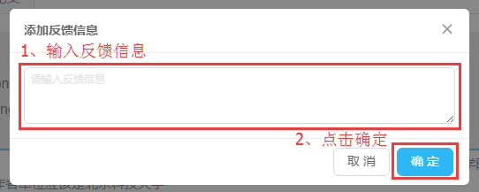

# 审核论文

### 登陆系统后——默认选择 *未审核的论文*标签

### 点击某一篇论文的 *审核* 按钮，开始审核

### 审核界面

1. 修改作者信息：修改英文姓名对应的教职工 [查看](audit_user.md)
2. 论文详细信息修改：修改论文本身的信息 [查看](audit_detail.md)
3. 其它信息修改：[查看](audit_others.md)

4. 添加反馈信息：

管理员可在审核时，添加反馈信息，申诉人可在其申诉信息中查看到该反馈信息。此功能提供简单的沟通方式，若情况复杂，还请直接与申诉人联系。
5. 设置为已审核：同一篇论文可能有多条申诉信息，某一条申诉信息是否审核完成，交由管理员确认。当论文审核完成时，请点击**设置为已审核**按钮。

