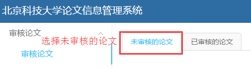
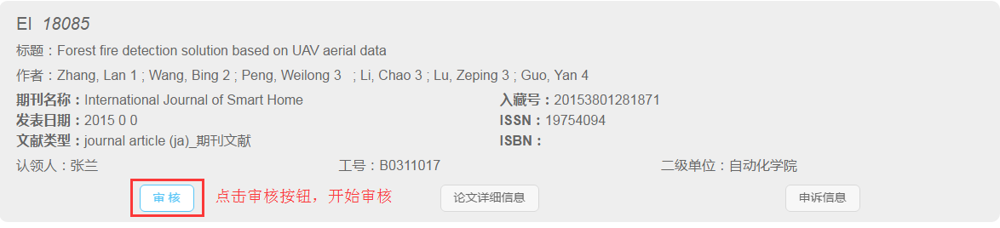
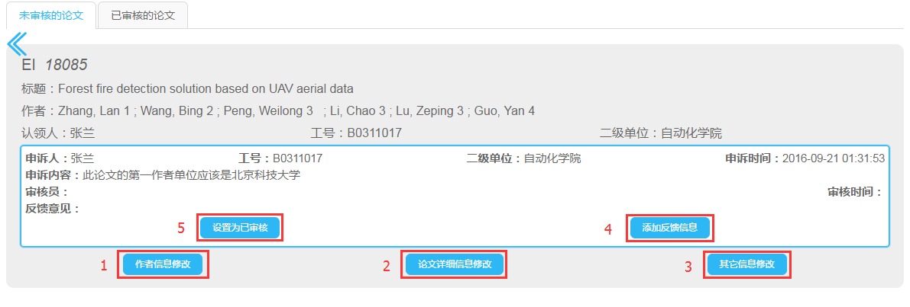

# 审核论文

### 登陆系统后——默认选择 *未审核的论文*标签

### 点击某一篇论文的 *审核* 按钮，开始审核

### 审核界面

1. [修改作者信息](audit_user.md)：修改英文姓名对应的教职工；
2. [论文详细信息修改](audit_detail.md)：修改论文本身的信息；
3. [其它信息修改](audit_others.md)

4. 添加反馈信息：
5. 设置为已审核：
