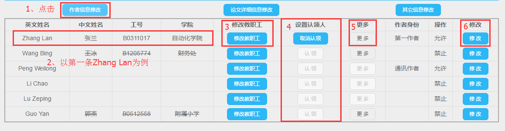
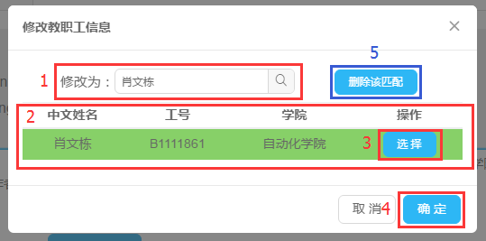
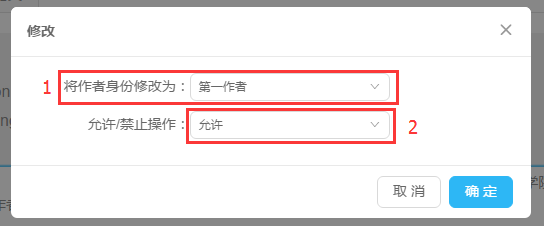

# 修改作者信息

### 作者信息修改

1. 点击**作者信息修改**按钮；
2. 以第一条Zhang Lan为例；
3. 我们假设此英文姓名对应的教职工***张兰***有误。则点击***修改教职工***按钮，弹出如下窗口：

如将原来的***张兰***老师修改为***肖文栋***老师：1、搜索框内输入“肖文栋”并点击搜索按钮；2、出现2中的内容，由于存在同名情况，检索见过可能不止一个；3、选择其中一个教职工；4、点击确定按钮即可修改完成。
如果原来的Zhang Lan英文拼音对应错误，需要删除对应的教职工，则点击5***删除该匹配***按钮即可。
4. 设置论文的认领人：同一篇论文只能有一个认领人，若要修改为其他人认领，则需先***取消认领***，然后再点击其他人***认领***；
5. ***更多***按钮，功能暂时还未开放；
6. ***修改***按钮：

1、修改当前作者在论文中的作者身份；2、保持允许即可，一般不需要修改。

