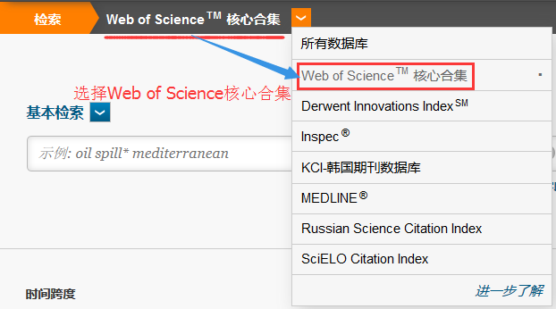
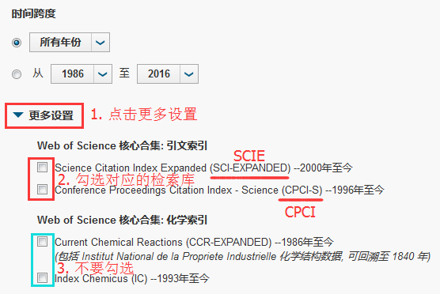
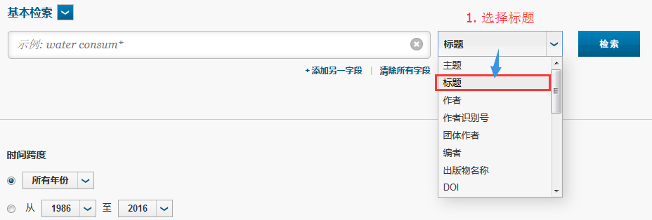

# 如何检索论文

###如何确定一篇论文是属于SCIE，还是CPCI
Web of Science检索官网为 [进入官网 Web of Science](http://apps.webofknowledge.com)

**第一步：**打开Web of Science 点击下拉菜单选择Web of Science核心合集，如图所示：

**第二步：**点击**更多设置**选择对应的检索检索机构，如图所示：

**第三步：**输入论文的标题，并选择检索方式为**标题**，点击**检索**按钮，如图所示：
